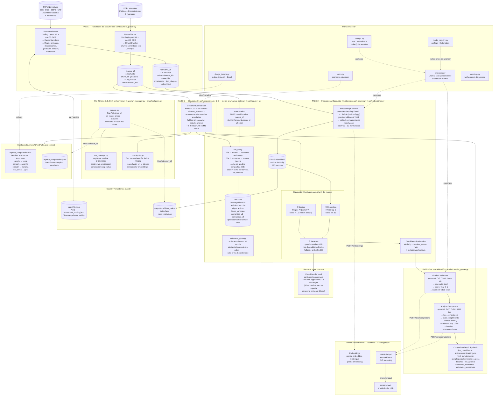

# Arquitectura — Comparador Automatizado de Normativas vs. Manuales Internos

Pipeline RAG de 5 fases que extrae, indexa y compara normativas ecuatorianas contra
manuales internos bancarios para identificar brechas de cumplimiento normativo.

> **Estado:** olas 0, 1 y 2 de la Fase 1 cerradas; de la Ola 3 ya está fusionado el motor
> de cobertura N:N (ítem 5) y de doble vía (ítem 6) — falta su UI, el selector de alcance
> (ítem 7) y el flag de revisión manual (ítem 10). El diagrama refleja el código en
> `feature/comparador-v2`. Las fases 2 y 3 del plan (contenedor + frontend, y nube)
> cambian el envoltorio y el sitio donde corre, no el pipeline: ver
> `PLAN_MEJORAS_ANEXO.md` §9 y §10.

## Diagrama General



## Stack Tecnológico

| Capa | Componente | Versión / Modelo |
|------|-----------|-----------------|
| Extracción PDF | Docling + ocrmac | 2.55.1 / ≥1.0.1 |
| Chunking | Docling HybridChunker | — |
| Embeddings | qwen3-embedding | 2560d (default en `src/config.py`) |
| Embeddings liviano | granite-embedding-multilingual | 768d (default en `master.ipynb`) |
| Vector Search | FAISS IndexFlatIP | 1.14.2 |
| Reranker | CrossEncoder local (sentence-transformers) | Qwen3-Reranker 0.6B |
| LLM Principal | gemma4 | latest (CoT) |
| LLM Fallback | smollm2-vllm | 1.7B |
| Validación salida | Pydantic | ≥2.10.0 |
| Export Excel | openpyxl | ≥3.1.0 |
| Aceleración | Apple Silicon MPS | M1/M2+ 16GB+ |

## Módulos Principales

```
src/
│  ── Pipeline ──────────────────────────────────────────────────────────
├── document_parser.py   # Fase 1: NormativaParser + ManualParser
├── embeddings.py        # Backends + LangChainEmbeddingsAdapter genérico
├── search_engine.py     # Fase 2: NormativaIndex (FAISS + léxico + reranker)
├── manual_index.py      # Ola 3 (ítem 6): ManualIndex, FAISS invertido sobre el manual
├── llm_grader.py        # Fases 3+4: LLMGrader + modelos Pydantic
├── comparator.py        # Fase 5: DocumentComparator (orquestador concurrente)
├── coverage.py          # Ola 3 (ítem 5): CoverageLink/LinkTable, modelo N:N artículo↔sección
├── dual.py              # Ola 3 (ítem 6): run_dual() — Vía 1 + Vía 2, caché de grading compartida
│
│  ── Orquestación y corridas (Ola 2) ────────────────────────────────────
├── service.py           # S10: orquestación sin Streamlit; RunPaths por run_id
├── checkpoint.py        # Ítem 3: persistencia incremental y reanudación sin reprocesar
│                         #   (app/run_manager.py, fuera de src/, es el registro de proceso — ítem 2)
│
│  ── Transversal (Ola 1) ────────────────────────────────────────────────
├── bootstrap.py         # Preparación del proceso; se aplica al importarse
├── config.py            # Defaults NO sensibles (deja de ser fuente de credenciales)
├── settings.py          # .env, precedencia UI>entorno>.env>config, redact()
├── providers.py         # ProviderSpec + fábricas: ÚNICO constructor de clientes
├── errors.py            # Taxonomía: qué aborta la corrida y qué degrada una fila
├── model_registry.py    # list/validate models + preflight con caché de 15 s
└── design_tokens.py     # Fuente única de paleta y tipografía (UI + Excel)
```
